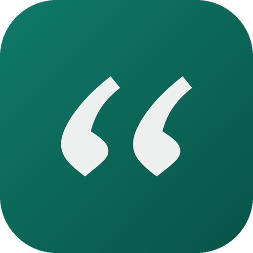

  

<h1 align="center">Voooxly</h1>

  <strong>Free, open-source dictation for Mac with a local AI brain.</strong> 
  Hold a key, speak, release — polished text appears where your cursor is. 
  Your voice never leaves your Mac.

  
  
  
  

<!--  — record before launch -->

## How it works

1. **Hold a key** — Voooxly starts listening and pauses your music.
2. **whisper.cpp transcribes** — fully on-device on Apple Silicon. Audio is never uploaded.
3. **The active mode cleans it up** — a local Ollama by default, or your own Claude / OpenAI / Gemini key. The LLM shapes your words; it never invents.
4. **Polished text pastes** at your cursor — Markdown renders where the app supports it, plain text everywhere else.
5. **It learns** — fix a word in the pasted text and Voooxly picks up the right spelling on your next dictation. On-device, opt-out in Settings.

### Writing modes

| Mode | What it does |
| --- | --- |
| **Organize & reply** | Cleans up your speech; replies come out message-ready. |
| **AI prompt** | Shapes your dictation into a clear LLM prompt. |
| **Summarize** | Condenses what you said into crisp bullets. |
| **Translate EN→ES** | Speak English, paste Spanish. |
| **Translate ES→EN** | Speak Spanish, paste English. |
| **Code / spec** | Turns dictation into a code spec or comment. |
| **Markdown notes** | Structures your speech as a markdown note. |
| **Command** | Say what you want written — get the draft. |
| **Verbatim** | Exactly what you said — no rewriting. |

## Features

- **9 writing modes** — see the table above.
- **100% local by design** — whisper.cpp on Apple Silicon. Optional AI polish via a local Ollama, or bring your own Claude/OpenAI/Gemini key. Audio is never uploaded, in any configuration.
- **Learns your words by itself** — fix a word in the pasted text and Voooxly picks up the right spelling on your next dictation. No word lists to maintain. It reads only the field it just pasted into, once, on-device — no screenshots, no tracking.
- **Fast** — sub-second transcription for typical sentences on Apple Silicon (p50 ~0.6 s in our benchmark; reproduce it with `scripts/bench_latency.sh`).
- **Everything else you'd expect** — live preview, hands-free latch, personal dictionary with "Correct last dictation", history search, and updates that install themselves.

## Install

Download the [latest DMG](https://github.com/crovettopro/voooxly/releases/latest/download/Voooxly.dmg), open, drag to Applications. Updates install themselves.

First launch asks for two permissions: **Microphone** (to hear you) and **Accessibility** (to paste where your cursor is). Both are required.

## En español

Voooxly habla tu idioma: interfaz, guía y onboarding en español automáticos, modos de
traducción ES↔EN y un diccionario que aprende tus nombres y marcas.
[Más en voooxly.com](https://voooxly.com).

## Privacy

Transcription runs on-device (whisper.cpp). Audio is never uploaded. The optional
AI polish step uses the backend YOU configure — local Ollama by default; with a
cloud backend, only transcribed text is sent, never your voice.

No account. No subscription. No telemetry.

## Contributing

See [CONTRIBUTING.md](CONTRIBUTING.md). Good first issues are labeled.

## License

MIT © Eduardo Crovetto